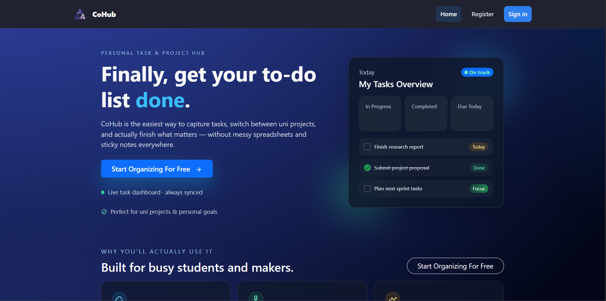
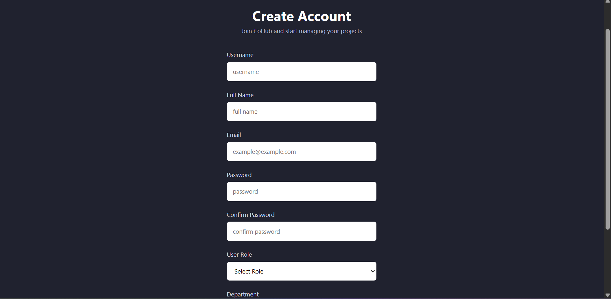
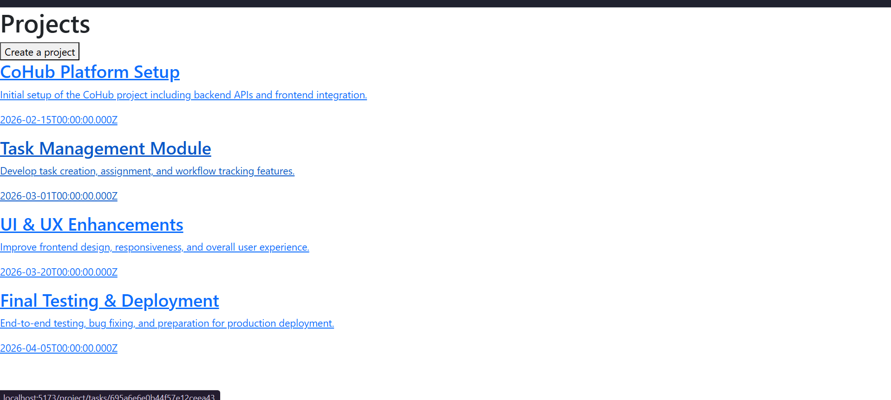
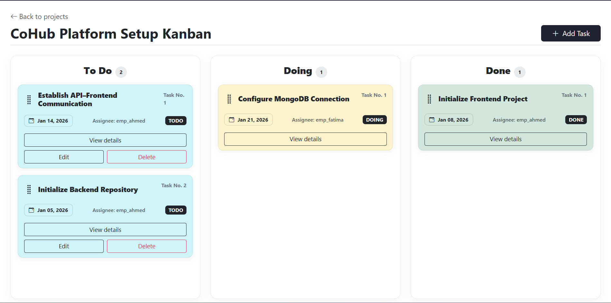
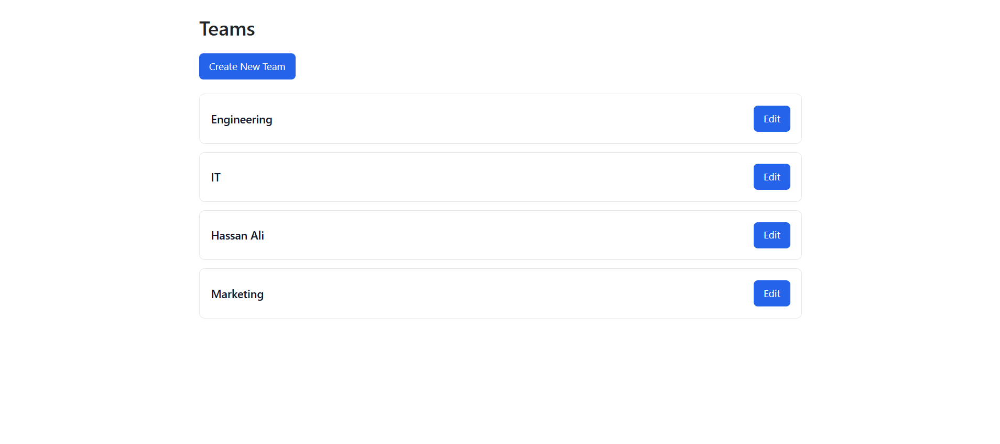

# 🧠 CoHub

**CoHub** is a collaborative **project and task management platform** designed to help individuals and teams **plan projects, track tasks, manage workflows, and improve productivity** in a structured and intuitive way.

It enables users to organize work into projects, assign tasks, track progress through statuses, and collaborate efficiently using a modern full‑stack web architecture.

---

# 📑 Table of Contents

- [🌐 Deployed Application](#-deployed-application)
- [🎯 Project Overview](#-project-overview)
- [🧩 Core Features](#-core-features)
  - [Project Management](#project-management)
  - [Task & Workflow Tracking](#task--workflow-tracking)
  - [Team Collaboration](#team-collaboration)
- [👤 Developer Role](#-developer-role)
- [🧱 System Highlights](#-system-highlights)
- [🗂️ Project Architecture](#️-project-architecture)
- [🛠️ Tech Stack](#️-tech-stack)
- [⚙️ Environment Variables](#️-environment-variables)
- [🧪 Getting Started](#-getting-started)
- [🔗 Project References](#-project-references)
- [📄 Credits](#-credits)
- [🚀 Future Enhancements](#-future-enhancements)

---

## Deployed Application

**Live App:** *(To be added)*

---
## Screenshots

Figure 1. Landing Page


Figure 2. Signup Page


Figure 3. Projects List Page


Figure 4. Tasks List Page


Figure 5. Teams List Page

---

## Project Overview

CoHub was built to address common challenges in project coordination by providing:

- Centralized **project management**
- Clear **task ownership and statuses**
- Visual progress tracking
- Scalable backend APIs
- Clean and responsive user interface

The system follows a separation of concerns between frontend and backend, ensuring maintainability and scalability.

---

## Core Features

### Project Management
- Create, update, and delete projects
- Set project descriptions and deadlines
- View all projects in a centralized dashboard

### Task & Workflow Tracking
- Create tasks within projects
- Assign task statuses (To Do, In Progress, Done)
- Update task details and deadlines
- Track progress visually

### Team Collaboration
- Multiple users working across projects
- Shared visibility of tasks and progress
- API-based data synchronization between FE & BE

---

## System Highlights

- RESTful API architecture
- Clear separation between frontend and backend
- Scalable MongoDB data models
- Modular code structure
- Environment‑based configuration

---

## Project Architecture

```
CoHub/
├─ CoHub-FE/
│  ├─ src/
│  ├─ public/
│  └─ vite.config.js
│
├─ CoHub-BE/ (Another repo)
│  ├─ src/
│  │  ├─ controllers/
│  │  ├─ routes/
│  │  ├─ models/
│  │  └─ middleware/
│  ├─ server.js
│  └─ package.json
└─ README.md
```

---

## 🛠️ Tech Stack

### Frontend
- React (Vite)
- JavaScript (ES6+)
- Axios
- CSS / Bootstrap

### Backend
- Node.js
- Express.js
- MongoDB
- Mongoose

---

## Environment Variables

### Backend (`.env`)
```
PORT=3000
MONGODB_URI=mongodb://localhost:27017/cohub
```

---

## Getting Started

### Clone Repositories
```bash
git clone https://github.com/BAlshowaikh/CoHub-FE.git
git clone https://github.com/BAlshowaikh/CoHub-BE.git
```

### Run Backend
```bash
cd CoHub-BE
npm install
npm run dev
```

### Run Frontend
```bash
cd CoHub-FE
npm install
npm run dev
```

Frontend will run at (Most probably):
```
http://localhost:5173
```

Backend will run at (Most probably):
```
http://localhost:3000
```

---

## Project References

- Frontend Repo: https://github.com/BAlshowaikh/CoHub-FE
- Backend Repo: https://github.com/BAlshowaikh/CoHub-BE

---

## Future Enhancements

- Integrate link to github feature on project creation.
- Add group chat feature for project.
- Add notification feature to be sent to PM once task status is changed.


---

## Credits

Developed by 

**Batool Alshowaikh** - Backend and frontend for `Task` & `Auth` style.

**Ali Tulefat** - Backend and frontend for `Teams` & `JWT`backend.

**Hassan**
Backend and frontend for `Projects`.


